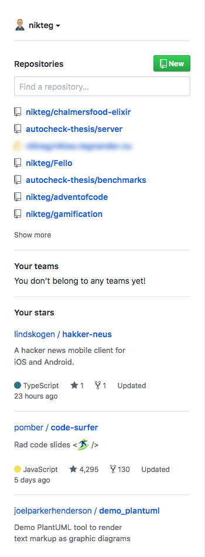

# GitHub Stars Dashboard

Adds your GitHub stars to the dashboard.

[](https://addons.mozilla.org/firefox/addon/github-stars-dashboard/)

## Screenshot



## Development

### Requirements

Install web-ext.

```
yarn global add web-ext
```

### Running

```
web-ext run
```

### Building

```
web-ext build
```

### Publishing

Bump the version in `manifest.json`, then sign & publish the extension for review.

```
web-ext sign --api-key=foo --api-secret=bar
```
